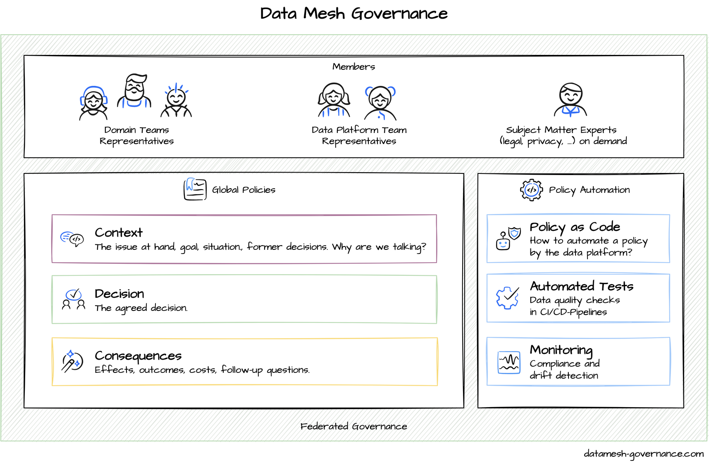

# Data Mesh Governance by Example

A curated list of examples for Data Mesh guiding values, architecture decisions, and global policies to support a federated governance group.

The data mesh governance group consists of representatives from the domain teams and the data platform team.

They are temporarily supported by a subject-matter experts, to address special issues, e.g. concerning legal, compliance, and security.

Together, they make sure that data products in the mesh are interoperable and can be used securely. For this, they agree on a few architectural decisions and global policies. To make it easy for domain teams to implement the policies, they specify the requirements for the data platform to automate the policies as much as possible.

However, it is always up to the domain teams to adhere to the policies.

## Guiding Values

- Minimize global decisions
- Optimize for generalist majority
- Embrace bounded contexts
- Standardize for interoperability
- Enforce consistent security 
- Design for automation 

## Architecture Decisions

Architecture decisions and policies are formulated as Architecture Decision Records (ADRs) using this [template](policies/_template.md).

_Note that some examples are only applicable in certain contexts or with specific data platforms._

### Data Platform

- AWS Athena as Query-Engine
- AWS Redshift as Data Platform
- AWS S3 as Storage for Data Products
- AWS Lake Formation as Data Catalog
- GCP BigQuery as Data Platform
- GCP BigQuery as Storage for Data Products
- GCP Cloud Storage as Storage for Data Products
- GCP Dataplex as Data Catalog
- Azure Synapse Analytics as Data Platform
- [Azure ADLS as Storage for Data Products](policies/platform/data-product-storage.md)
- Azure Purview as Data Catalog
- Snowflake as Data Platform
- [Databricks as Data Platform](policies/platform/databricks-as-data-platform.md)
- Databricks Unity as Data Catalog
- Collibra as Data Catalog
- Atlan as Data Catalog
- Simple Wiki Page as Data Catalog
- Presto as On-Premise Query-Engine
- MinIO as On-Premise Storage for Data Products

### Structure
- Separate Account per Domain Team
- Separate Database per Domain Team
- Separate Schema per Domain Team
- Bucket/Folder Structure
    - 1 bucket for organization
    - 1 bucket per team
    - 1 bucket per data product
- Address scheme

## Policies

### Interoperability
- JSON File Format
- [Parquet File Format](policies/interoperability/parquet-file-format.md)
- Delta File Format
- Table Naming Conventions
- Column Naming Conventions
- File Name Conventions
- Partitioning Keys
- Timestamp as ISO-8601 Strings
- Money amounts in cents as integers
- Common IDs
- Common Fields Names
- Bitemporal Timestamp Fields

### Discoverability
- Registration of Data Product in Wiki
- Registration of Data Product in Data Catalog
- Mandatory Ownership Information
- Mandatory Tags

### Quality
- Minimum level quality of a data product

### Documentation
- Documentation in Wiki
- Documentation in Data Catalog
- Mandatory Fields for Data Products
- Schema Format

### Access Control
- Access granted through AWS IAM Policies
- ACLs managed by Domain Teams
- Reassess after x month

### Consent Management
- Consents Provided by Checkout Domain

### Privacy & Compliance
- Data Classification Scheme (restricted, sensitive, unrestricted)
- Data Stored in Customer's Business Region
- PII Anonymization
- PHI (protected health info)
- Data Retention Periods
- Right to be Forgotten By Tombstone Events

### Security
- [Encryption at Rest](policies/security/encryption-at-rest.md)
- Encryption at Transit
- VPC

### Monitoring
- Observability Metrics
- Cost reporting

### Ownership (TBD)
- Ownership for New Data Products
- Ownership for Legacy Data Products

### Other
- Generic Policy

## Template

- [Template](policies/_template.md)
